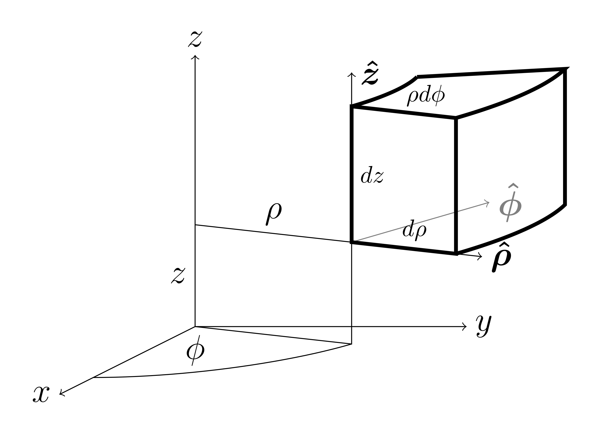
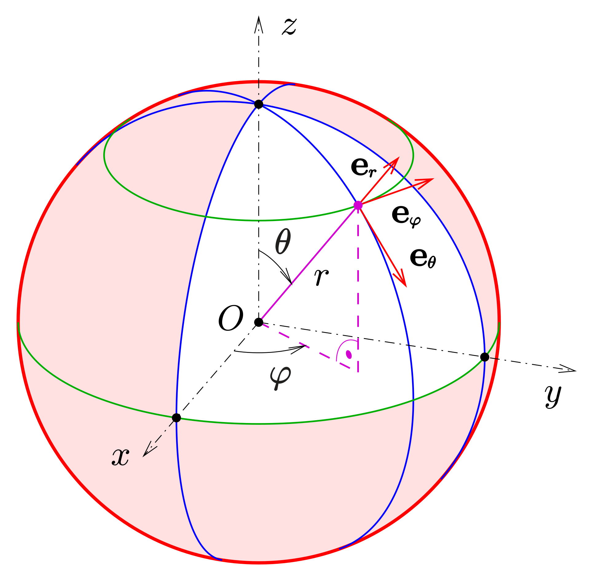
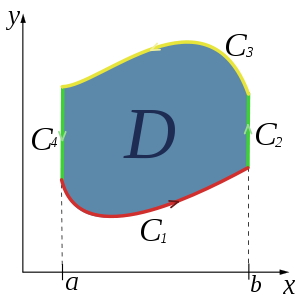
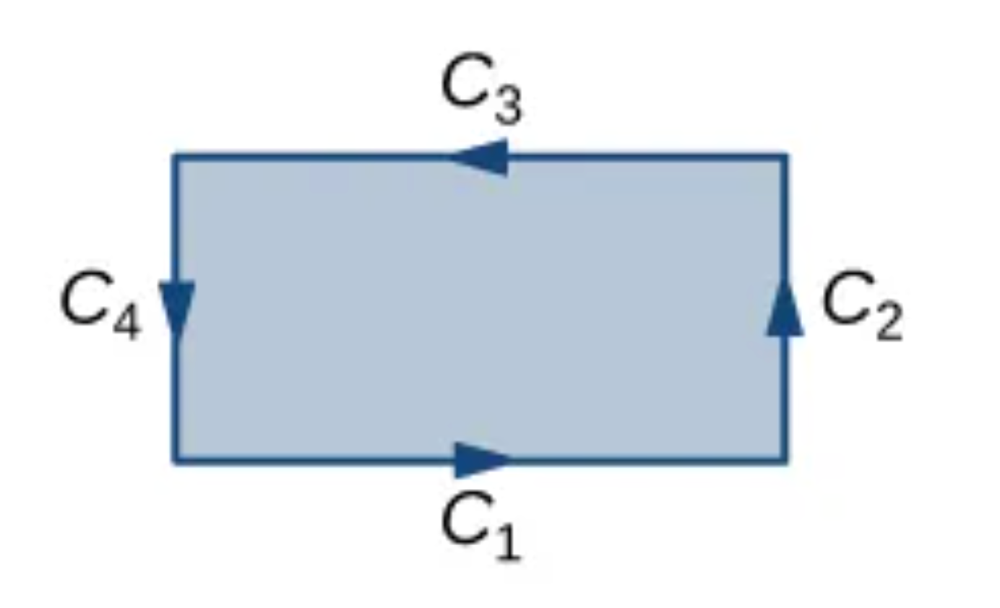

# 图形学需要的数学

## 向量

设$\vec{a}=(x_1,y_1,z_1),\vec{b}=(x_2,y_2,z_2)$
$$
\vec{a}\cdot\vec{b}=|\vec{a}||\vec{b}|\cos\theta=x_1y_1+x_2y_2+x_3y_3
$$

$$
|\vec{a}\times\vec{b}|=|\vec{a}||\vec{b}|\sin\theta
$$

$$
\vec{a}\times\vec{b}=
\begin{vmatrix}
i&j&k\\
x_1&y_1&z_1\\
x_2&y_2&z_2
\end{vmatrix}
=(y_1z_2-y_2z_1,x_2z_1-x_1z_2,x_1y_z-x_2y_1)
$$

设平面$S_1=A_1x+B_1y+C_1z+D=0,S_2=A_2x+B_2y+C_2z+D=0$，当$S_1\cap S_2=L\neq\emptyset$
$$
\left\{\begin{matrix}
\vec{n_{1}}=(A_1,B_1,C_1)
 \\
\vec{n_{2}}=(A_2,B_2,C_2)
\end{matrix}\right.
$$
则有
$$
\left\{\begin{matrix}
\vec{l}\cdot\vec{n_1}=0
\\
\vec{l}\cdot\vec{n_2}=0
\end{matrix}\right.
$$
即
$$
\vec{l}=\vec{n_1}\times\vec{n_2}
$$

## 多元函数

函数$f(x,y,z)$

全微分
$$
\mathrm{d}f=\frac{\partial f}{\partial x}\mathrm{d}x+\frac{\partial f}{\partial y}\mathrm{d}y+\frac{\partial f}{\partial z}\mathrm{d}z
$$
梯度
$$
\bigtriangledown f=\frac{\partial f}{\partial x}\vec{e_x}+\frac{\partial f}{\partial y}\vec{e_y}+\frac{\partial f}{\partial z}\vec{e_z}
$$
线元
$$
d\vec{r}=\mathrm{d}x\cdot \vec{e_x}+\mathrm{d}y\cdot \vec{e_y}+\mathrm{d}z\cdot \vec{e_z}
$$
有
$$
\mathrm{d}f=\bigtriangledown f\cdot\mathrm{d}\vec{r}
$$

> 类比一维情况$\mathrm{d}f(x)=f'(x)\mathrm{d}x$，以直观上的理解，$\bigtriangledown f$是变化率，$\mathrm{d}\vec{r}$是变化量

$x=X(u,v,w),y=Y(u,v,w),z=Z(u,v,w)$，链式法则
$$
\frac{\partial f}{\partial u}=\frac{\partial f}{\partial x}\frac{\partial x}{\partial u}+\frac{\partial f}{\partial y}\frac{\partial y}{\partial u}+
\frac{\partial f}{\partial z}\frac{\partial z}{\partial u}
$$

$$
\frac{\partial f}{\partial v}=\frac{\partial f}{\partial x}\frac{\partial x}{\partial v}+\frac{\partial f}{\partial y}\frac{\partial y}{\partial v}+
\frac{\partial f}{\partial z}\frac{\partial z}{\partial v}
$$

$$
\frac{\partial f}{\partial w}=\frac{\partial f}{\partial x}\frac{\partial x}{\partial w}+\frac{\partial f}{\partial y}\frac{\partial y}{\partial w}+
\frac{\partial f}{\partial z}\frac{\partial z}{\partial w}
$$

### 散度

散度是针对矢量场，表示各个方向上的曲面上是否有逃逸

对于三维矢量函数
$$
F(x,y,z)=F_x(x,y,z)\vec{e_x}+F_y(x,y,z)\vec{e_y}+F_z(x,y,z)\vec{e_z}
$$
以$x$方向为例
$$
X_-=-F_x(x,y,z)\mathrm{d}y\mathrm{d}z
$$

$$
X_+=F_x(x+\mathrm{d}x,y,z)\mathrm{d}y\mathrm{d}z
$$

即
$$
X_+ + X_-=\left[F_x(x+\mathrm{d}x,y,z)-F(x,y,z)\right]\mathrm{d}y\mathrm{d}z
=\frac{\partial F_x}{\partial x}\mathrm{d}x\mathrm{d}y\mathrm{d}z
$$
六个方向和为
$$
\left(\frac{\partial F_x}{\partial x} + \frac{\partial F_y}{\partial y} + \frac{\partial F_z}{\partial z}\right)
\mathrm{d}x\mathrm{d}y\mathrm{d}z
=\left(\frac{\partial F_x}{\partial x} + \frac{\partial F_y}{\partial y} + \frac{\partial F_z}{\partial z}\right)
\mathrm{d}V
$$
散度是针对某点的逃逸的标量，消去体积元$\mathrm{d}V$，即
$$
\mathbf{div}F=\frac{\partial F_x}{\partial x} + \frac{\partial F_y}{\partial y} + \frac{\partial F_z}{\partial z}
=\bigtriangledown\cdot F
$$

## 坐标系

### 柱坐标系

$$
\left\{\begin{matrix}
x=\rho\cos\varphi
\\
x=\rho\sin\varphi
\\
z=z
\end{matrix}\right.
$$
基向量
$$
\left\{\begin{matrix}
\vec{e_\rho}=(\cos\varphi,\sin\varphi,0)
 \\
\vec{e_\varphi}=(-\sin\varphi,\cos\varphi,0)
 \\
\vec{z}=(0,0,1)
\end{matrix}\right.
$$
线元
$$
\mathrm{d}\vec{r}=\mathrm{d}\rho\cdot\vec{e_{\rho}}
+\rho\mathrm{d}\varphi\cdot\vec{e_{\varphi}}
+\mathrm{d}z\cdot\vec{e_{z}}
$$
$xy$面元
$$
\mathrm{d}S=\rho\mathrm{d}\rho\mathrm{d}\theta
$$
体元
$$
\mathrm{d}V=\rho\mathrm{d}\rho\mathrm{d}\theta\mathrm{d}z
$$
根据
$$
\mathrm{d} f = \bigtriangledown f\cdot\mathrm{d}\vec{r}
$$
根据基向量互相正交
$$
\bigtriangledown f 
=\frac{\partial f}{\partial \rho}\vec{e_{\rho}}
+\frac{1}{\rho}\frac{\partial f}{\partial \varphi}\vec{e_{\varphi}}
+\frac{\partial f}{\partial z}\vec{e_{z}}
$$
由于
$$
\bigtriangleup=\bigtriangledown \cdot \bigtriangledown
$$
即
$$
\bigtriangleup=
(\frac{\partial}{\partial \rho}\mathrm{d}\rho
+\frac{\partial}{\partial \varphi}\mathrm{d}\varphi
+\frac{\partial}{\partial z}\mathrm{d}z)
\cdot
(\frac{\partial}{\partial \rho}\mathrm{d}\rho
+\frac{\partial}{\partial \varphi}\mathrm{d}\varphi
+\frac{\partial}{\partial z}\mathrm{d}z)
$$
展开化简，根据链式法则，带入下面计算的结果
$$
\frac{\partial \vec{e_i}}{\partial j}\cdots(i\in \{\rho, \varphi, z\},j\in \{\rho, \varphi, z\})
$$
化简得
$$
\bigtriangleup=
\frac{1}{\rho}\frac{\partial}{\partial\rho}+\frac{\partial^2}{\partial\rho^2}
+\frac{1}{\rho^2}\frac{\partial^2}{\partial\varphi^2}
+\frac{\partial^2}{\partial z^2}
$$
凑微分
$$
\bigtriangleup=
\frac{1}{\rho}\frac{\partial}{\partial\rho}(\rho\frac{\partial}{\partial\rho})
+\frac{1}{\rho^2}\frac{\partial^2}{\partial\varphi^2}
+\frac{\partial^2}{\partial z^2}
$$
即
$$
\bigtriangleup f=
\frac{1}{\rho}\frac{\partial}{\partial\rho}(\rho\frac{\partial f}{\partial\rho})
+\frac{1}{\rho^2}\frac{\partial^2 f}{\partial\varphi^2}
+\frac{\partial^2 f}{\partial z^2}
$$

### 球坐标系

$$
\left\{\begin{matrix}
x=r\sin\theta\cos\varphi
\\
y=r\sin\theta\sin\varphi
\\
z=r\cos\theta
\end{matrix}\right.
$$
基向量
$$
\left\{\begin{matrix}
\vec{e_r}=(\sin\theta\cos\varphi,\sin\theta\sin\varphi,\cos\theta)
 \\
\vec{e_\theta}=(\cos\theta\cos\varphi,\cos\theta\sin\varphi,-\sin\theta)
 \\
\vec{e_\varphi}=(-\sin\varphi,\cos\varphi,0)
\end{matrix}\right.
$$
由于
$$
\vec{r}=(r\sin\theta\cos\varphi, r\sin\theta\sin\varphi,r\cos\theta)
$$
即
$$
\left|\frac{\partial \vec{r}}{\partial r}\right |=
\left|(\sin\theta\cos\varphi, \sin\theta\sin\varphi,\cos\theta)\right|=r
$$

$$
\left|\frac{\partial \vec{r}}{\partial \theta}\right |=
\left|(r\cos\theta\cos\varphi, r\cos\theta\sin\varphi,-r\sin\theta)\right|=r
$$

$$
\left|\frac{\partial \vec{r}}{\partial \varphi}\right |=
\left|(-r\sin\theta\sin\varphi, r\sin\theta\cos\varphi,0)\right|=r\sin\theta
$$

线元
$$
\mathrm{d}\vec{r}=\mathrm{d}r\cdot\vec{e_{r}}
+r\mathrm{d}\theta\cdot\vec{e_{\theta}}
+r\sin\theta\mathrm{d}\varphi\cdot\vec{e_{\varphi}}
$$
根据
$$
\mathrm{d} f = \bigtriangledown f\cdot\mathrm{d}\vec{r}
$$
即
$$
\bigtriangledown f=\frac{\partial f}{\partial r}\vec{e_r}
+\frac{1}{r}\frac{\partial f}{\partial\theta}\vec{e_\theta}
+\frac{1}{r\sin\theta}\frac{\partial f}{\partial \varphi}\vec{e_\varphi}
$$
由于
$$
\bigtriangleup=\bigtriangledown\cdot\bigtriangledown
$$
即
$$
\bigtriangleup=
(\frac{\partial}{\partial r}\vec{e_r}
+\frac{1}{r}\frac{\partial}{\partial\theta}\vec{e_\theta}
+\frac{1}{r\sin\theta}\frac{\partial}{\partial \varphi}\vec{e_\varphi})
\cdot
(\frac{\partial}{\partial r}\vec{e_r}
+\frac{1}{r}\frac{\partial}{\partial\theta}\vec{e_\theta}
+\frac{1}{r\sin\theta}\frac{\partial}{\partial \varphi}\vec{e_\varphi})
$$
展开化简，根据链式法则，带入下面计算的结果
$$
\frac{\partial \vec{e_i}}{\partial j}\cdots(i\in \{r, \theta, \varphi\},j\in \{r, \theta, \varphi\})
$$
化简得
$$
\bigtriangleup=\frac{2}{r}\frac{\partial}{\partial r}+\frac{\partial^2}{\partial r^2}
+\frac{\cos\theta}{r^2\sin\theta}\frac{\partial}{\partial \theta}+\frac{1}{r^2}\frac{\partial^2}{\partial \theta^2}
+\frac{1}{r^2\sin^2\theta}\frac{\partial^2}{\partial \varphi^2}
$$
凑微分
$$
\bigtriangleup=\frac{1}{r^2}\frac{\partial}{\partial r}(r^2\frac{\partial}{\partial r})
+\frac{1}{r^2\sin\theta}\frac{\partial}{\partial \theta}(\sin\theta\frac{\partial}{\partial \theta})
+\frac{1}{r^2\sin^2\theta}\frac{\partial^2}{\partial \varphi^2}
$$
即
$$
\bigtriangleup=\frac{1}{r^2}\frac{\partial}{\partial r}(r^2\frac{\partial f}{\partial r})
+\frac{1}{r^2\sin\theta}\frac{\partial}{\partial \theta}(\sin\theta\frac{\partial f}{\partial \theta})
+\frac{1}{r^2\sin^2\theta}\frac{\partial^2 f}{\partial \varphi^2}
$$

## 曲线积分

### 标量曲线积分

类比求曲线物体的质量
$$
dS=\sqrt{(\mathrm{d}x)^2+(\mathrm{d}y)^2}=\sqrt{1+(y')^2}\cdot \mathrm{d}x
=\sqrt{1+(x')^2}\cdot \mathrm{d}y\cdots (\mathrm{d}x>0,\mathrm{d}y>0)
$$

$$
\int_L f(x,y)\mathrm{d}S
$$

### 矢量曲线积分

类比求曲线运动的功
$$
F(x,y)=f_x(x,y)\vec{e_x}+f_y(x,y)\vec{e_y}
$$

$$
dS=\mathrm{d}x\cdot\vec{e_x}+\mathrm{d}y\cdot\vec{e_y}
$$

$$
\int_L F(x,y)\mathrm{d}S=\int_L f_x(x,y)\mathrm{d}x+f_y(x,y)\mathrm{d}y
$$

### Green's theorem

Green's theorem是环路积分与二重积分转换的工具

将区域$D$分成无限小的下面的方格，由于中间相邻的曲线积分都被抵消，因此可以看作全体方格的曲线积分的和

对于单个方格

$$
C_1=P\mathrm{d}x 
$$

$$
C_2=(Q+\frac{\partial Q}{\partial x}\mathrm{d}x)\mathrm{d}y
$$

$$
C_3=(P+\frac{\partial P }{\partial y}\mathrm{d}y)(-\mathrm{d}x)
$$

$$
C_4=Q(-\mathrm{d}y)
$$

即
$$
C_1+C_2+C_3+C_4=\left(\frac{\partial P}{\partial x}-\frac{\partial P}{\partial y}\right)\mathrm{d}x\mathrm{d}y
$$
得到Green's theorem
$$
\oint_{L}P\mathrm{d}x+Q\mathrm{d}y=\iint_D\left(\frac{\partial Q}{\partial x}-\frac{\partial P}{\partial y}\right)\mathrm{d}x\mathrm{d}y
$$
对于$A$到$B$的路径$L_1$
$$
\int_{L}P\mathrm{d}x+Q\mathrm{d}y
$$
补充任意一段$B$到$A$的路径$L_2$使其形成环
$$
\int_{L_1}P\mathrm{d}x+Q\mathrm{d}y+\int_{L_2}P\mathrm{d}x+Q\mathrm{d}y=
\iint_D\left(\frac{\partial Q}{\partial x}-\frac{\partial P}{\partial y}\right)\mathrm{d}x\mathrm{d}y
$$
当满足
$$
\frac{\partial Q}{\partial x}-\frac{\partial P}{\partial y}=0
$$
即
$$
\int_{L_1}P\mathrm{d}x+Q\mathrm{d}y=-\int_{L_2}P\mathrm{d}x+Q\mathrm{d}y
$$
因此路径$L_1$的积分与任意$A$到$B$的路径$L_2$的积分都相等，即路径无关

## 曲面积分

### 标量曲面积分

类比求曲面物体的质量

设曲面$z=Z(x,y)$，面微元$dS$在$xy$平面上投影为
$$
\mathrm{d}x\mathrm{d}y
$$
该曲面等价于向量函数$\vec{v}(x,y)=(x,y,Z(x,y))$
$$
\frac{\partial \vec{v}}{\partial x}=\left(1,0,\frac{\partial Z}{\partial x}\right)
$$

$$
\frac{\partial \vec{v}}{\partial y}=\left(0,1,\frac{\partial Z}{\partial y}\right)
$$

代入有
$$
dS=|\frac{\partial \vec{v}}{\partial x}\times\frac{\partial \vec{v}}{\partial y}|\mathrm{d}x\mathrm{d}y
=\left|\left(-\frac{\partial Z}{\partial x},-\frac{\partial Z}{\partial y},1\right)\right|\mathrm{d}x\mathrm{d}y
=\sqrt{\left(\frac{\partial Z}{\partial x}\right)^2+\left(\frac{\partial Z}{\partial y}\right)^2+1}~
\mathrm{d}x\mathrm{d}y
$$
即
$$
\iint_S f(x,y,Z(x,y))
\sqrt{\left(\frac{\partial Z}{\partial x}\right)^2+\left(\frac{\partial Z}{\partial y}\right)^2+1}~
\mathrm{d}x\mathrm{d}y
$$

### 矢量曲面积分

类比求曲面物体通过不同截面的流量，推导类比矢量曲线积分，注意方向正负
$$
\iint_S f(X(y,z),y,z)\mathrm{d}y\mathrm{d}z 
+f(x,Y(x,z),z)\mathrm{d}x\mathrm{d}z
+f(x,y,Z(x,y))\mathrm{d}x\mathrm{d}y
$$
