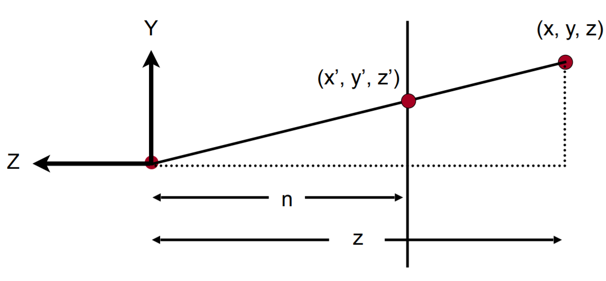

## VP Matrix in Coordinate

### View

#### Left Hand

$V$矩阵用于将模型变换到Camera空间

通常依赖下列参数

- Camera位置$(x_p,y_p,z_p)$
- Up方向$(x_u,y_u,z_u)$
- LookAt方向$(x_l,y_l,z_l)$

对于观察者而言，模型做任何变换等价与Camera做对应的逆变换

初始态$V_{0}$没有任何变换，即在原点往$z$轴方向看（左手系），Up方向$y$轴

- Camera位置$(0,0,0)$
- Up方向$(0,1,0)$
- LookAt方向$(0,0,1)$

$V\rightarrow V_{0}$等价于

- Translate 
  - $(x_p,y_p,z_p)\rightarrow (0,0,0)$
- Rotate
  - X  $(x_u,y_u,z_u)\times(x_l,y_l,z_l)=(x_r,y_r,z_r) \rightarrow (0,1,0)\times(0,0,1)=(1,0,0)$
  - Y $(x_u,y_u,z_u) \rightarrow(0,1,0)$
  - Z $(x_l,y_l,z_l) \rightarrow(0,0,1)$

Translate为
$$
V_t=
\begin{bmatrix}
1&0&0&-x_p\\
0&1&0&-y_p\\
0&0&1&-z_p\\
0&0&0&1
\end{bmatrix}
$$
Rotate不好直接写出，考虑逆变换的旋转矩阵
$$
\left\{\begin{matrix}
V_r^{-1}\times(1,0,0,0)^T=(x_r,y_r,z_r,0)\\
V_r^{-1}\times(0,1,0,0)^T=(x_u,y_u,z_u,0)\\
V_r^{-1}\times(0,0,1,0)^T=(x_l,y_l,z_l,0)
\end{matrix}\right.
$$
得到
$$
V_r^{-1}=
\begin{bmatrix}
x_r&x_u&x_l&0\\
y_r&y_u&y_l&0\\
z_r&z_u&z_l&0\\
0&0&0&1
\end{bmatrix}
$$
通常取旋转矩阵$V_r$为正交矩阵
$$
V_r^{-1}=V_r^{T}
$$
即
$$
V_r=
\begin{bmatrix}
x_r&y_r&z_r&0\\
x_u&y_u&z_u&0\\
x_l&y_l&z_l&0\\
0&0&0&1
\end{bmatrix}
$$
因此
$$
V=V_rV_t=
\begin{bmatrix}
x_r&y_r&z_r&-(x_px_r+y_py_r+z_pz_r)\\
x_u&y_u&z_u&-(x_px_u+y_py_u+z_pz_u)\\
x_l&y_l&z_l&-(x_px_l+y_py_l+z_pz_l)\\
0&0&0&1
\end{bmatrix}
$$
实际上构建$V$矩阵是通过下列参数控制的
$$
\left\{\begin{matrix}
(x_p,y_p,z_p)=position\\
(w_x,w_y,w_z)=world~up\\
(x_l,y_l,z_l)=look~at\\
\end{matrix}\right.
$$
带入即可求得
$$
\left\{\begin{matrix}
(x_r,y_r,z_r)=world~up\times look~at\\
(x_u,y_u,z_u)=look~at\times~(x_r,y_r,z_r)
\end{matrix}\right.
$$

这是glm::lookAtLH函数返回的view matrix

#### Right Hand

区别是LookAt方向$(0,0,-1)$，因此
$$
V_r^{-1}\times(0,0,-1,0)^T=(x_l,y_l,z_l,0)
$$
求得
$$
V_r^{-1}=
\begin{bmatrix}
x_r&x_u&-x_l&0\\
y_r&y_u&-y_l&0\\
z_r&z_u&-z_l&0\\
0&0&0&1
\end{bmatrix}
$$
即
$$
V_r=
\begin{bmatrix}
x_r&y_r&z_r&0\\
x_u&y_u&z_u&0\\
-x_l&-y_l&-z_l&0\\
0&0&0&1
\end{bmatrix}
$$
因此
$$
V=V_rV_t=
\begin{bmatrix}
x_r&y_r&z_r&-(x_px_r+y_py_r+z_pz_r)\\
x_u&y_u&z_u&-(x_px_u+y_py_u+z_pz_u)\\
-x_l&-y_l&-z_l&x_px_l+y_py_l+z_pz_l\\
0&0&0&1
\end{bmatrix}
$$
这里
$$
\left\{\begin{matrix}
(x_r,y_r,z_r)=look~at\times~world~up\\
(x_u,y_u,z_u)=(x_r,y_r,z_r)\times~look~at
\end{matrix}\right.
$$
这是glm::lookAtRH函数返回的view matrix

### Projection

#### Orthographic

本质上是下面的映射
$$
R^3\in\{\left[l,r\right]\times\left[t,b\right]\times\left[n,f\right]\}
\rightarrow
R^3\in\{\left[-1,1\right]^3\}
$$

- Translate $\left(0,0,0\right)$
- Scale $\left(2,2,2\right)$

$$
P_{o}=
\begin{bmatrix}
\frac{2}{r-l}&0&0&0\\
0&\frac{2}{t-b}&0&0\\
0&0&\frac{2}{f-n}&0\\
0&0&0&1
\end{bmatrix}
\times
\begin{bmatrix}
1&0&0&-\frac{r+l}{2}\\
0&1&0&-\frac{t+b}{2}\\
0&0&1&-\frac{f+n}{2}\\
0&0&0&1
\end{bmatrix}
=
\begin{bmatrix}
\frac{2}{r-l}&0&0&-\frac{r+l}{r-l}\\
0&\frac{2}{t-b}&0&-\frac{t+b}{t-b}\\
0&0&\frac{2}{f-n}&-\frac{f+n}{f-n}\\
0&0&0&1
\end{bmatrix}
$$

$P_{o}$有点复杂，对于渲染屏幕宽度为$(W,H)$，通常我们取
$$
\left\{\begin{matrix}
l=-\frac{W}{2}\\
r=\frac{W}{2}\\
b=-\frac{H}{2}\\
t=\frac{H}{2}
\end{matrix}\right.
$$
可以化简为
$$
P_{o}=
\begin{bmatrix}
\frac{2}{W}&0&0&0\\
0&\frac{2}{H}&0&0\\
0&0&\frac{2}{f-n}&-\frac{f+n}{f-n}\\
0&0&0&1
\end{bmatrix}
$$

#### Perspective

Perspective投影可以由Orthographic投影经过变换$P_{o\rightarrow p}$得到

对于Homogeneous coordination下面经过$P_{o}$变换得到的3D Point$(x,y,z,1)$，经过$P_{o\rightarrow p}$得到3D Point$(x',y',z',1)$

根据相似三角形
$$
\left\{\begin{matrix}
x'=\frac{nx}{z}=P_{o\rightarrow p}[0]\cdot(x,y,z,1)\\
y'=\frac{ny}{z}=P_{o\rightarrow p}[1]\cdot(x,y,z,1)
\end{matrix}\right.
$$
不希望得到的$P_{o\rightarrow p}$中含有坐标相关的变量$z$

因此根据Homogeneous vector的定义，把变换后的坐标改写一下（这里左右两边的$z'$是不一样的，这里简写了）
$$
\left(\frac{nx}{z},\frac{ny}{z},z',1\right)\rightarrow\left(nx,ny,z',z\right)
$$
即
$$
\left\{\begin{matrix}
nx=P_{o\rightarrow p}[0]\cdot(x,y,z,1)\\
ny=P_{o\rightarrow p}[1]\cdot(x,y,z,1)\\
z=P_{o\rightarrow p}[3]\cdot(x,y,z,1)\\
\end{matrix}\right.
$$
得到
$$
\left\{\begin{matrix}
P_{o\rightarrow p}[0]=(n,0,0,0)\\
P_{o\rightarrow p}[1]=(0,n,0,0)\\
P_{o\rightarrow p}[3]=(0,0,1,0)
\end{matrix}\right.
$$
near面上的点$P_{o\rightarrow p}$变换前后不变，far面上的中心点$P_{o\rightarrow p}$变换前后位置不变
$$
\left\{\begin{matrix}
P_{o\rightarrow p}\times(x,y,n,1)^T\rightarrow(xn,yn,n^2,n)\\
P_{o\rightarrow p}\times(0,0,f,1)^T\rightarrow(0,0,f^2,f)\\
\end{matrix}\right.
$$
即
$$
\left\{\begin{matrix}
P_{o\rightarrow p}[2]\cdot(x,y,n,1)=n^2\\
P_{o\rightarrow p}[2]\cdot(0,0,f,1)=f^2\\
\end{matrix}\right.
$$
待定系数，求解得到
$$
P_{o\rightarrow p}[2]=(0,0,f+n,-fn)
$$
即
$$
P_{o\rightarrow p}=
\begin{bmatrix}
n&0&0&0\\
0&n&0&0\\
0&0&f+n&-fn\\
0&0&1&0
\end{bmatrix}
$$
因此有
$$
P_p=P_o\times P_{o\rightarrow p}=
\begin{bmatrix}
\frac{2n}{W}&0&0&0\\
0&\frac{2n}{H}&0&0\\
0&0&\frac{f+n}{f-n}&-\frac{2fn}{f-n}\\
0&0&1&0
\end{bmatrix}
$$
实际上构建$P_p$矩阵是通过下列参数控制的
$$
\left\{\begin{matrix}
aspect = \frac{W}{H}\\
\frac{H}{2n}=\tan(\frac{fov}{2})\\
n=n\\
f=f
\end{matrix}\right.
$$
即
$$
\frac{2n}{W}=\frac{2}{H\cdot aspect}\cdot\frac{H}{2\tan(\frac{fov}{2})}=\frac{1}{aspect\cdot\tan(\frac{fov}{2})}
$$

$$
\frac{2n}{H}=\frac{1}{\tan(\frac{fov}{2})}
$$

因此
$$
P_p=
\begin{bmatrix}
\frac{1}{aspect\cdot\tan(\frac{fov}{2})}&0&0&0\\
0&\frac{1}{\tan(\frac{fov}{2})}&0&0\\
0&0&\frac{f+n}{f-n}&-\frac{2fn}{f-n}\\
0&0&1&0
\end{bmatrix}
$$
这是glm::perspectiveLH_NO函数返回的projection matrix

#### 01Depth

上面的深度$z\in[-1, 1]$，实际上Vulkan之类的API的$z\in[0, 1]$，因此
$$
P_{o}=
\begin{bmatrix}
\frac{2}{W}&0&0&0\\
0&\frac{2}{H}&0&0\\
0&0&\frac{1}{f-n}&0\\
0&0&0&1
\end{bmatrix}
\times
\begin{bmatrix}
1&0&0&0\\
0&1&0&0\\
0&0&1&-n\\
0&0&0&1
\end{bmatrix}
=\begin{bmatrix}
\frac{2}{W}&0&0&0\\
0&\frac{2}{H}&0&0\\
0&0&\frac{1}{f-n}&-\frac{n}{f-n}\\
0&0&0&1
\end{bmatrix}
$$
此时
$$
P_p=\begin{bmatrix}
\frac{2}{W}&0&0&0\\
0&\frac{2}{H}&0&0\\
0&0&\frac{f}{f-n}&-\frac{fn}{f-n}\\
0&0&1&0
\end{bmatrix}
$$
使用控制参数表示
$$
P_p=
\begin{bmatrix}
\frac{1}{aspect\cdot\tan(\frac{fov}{2})}&0&0&0\\
0&\frac{1}{\tan(\frac{fov}{2})}&0&0\\
0&0&\frac{f}{f-n}&-\frac{fn}{f-n}\\
0&0&1&0
\end{bmatrix}
$$
这是glm::perspectiveLH_ZO函数返回的projection matrix

#### RightHand

右手系于左手系相比，就是$z$轴反向了，而$xy$轴保持不变

因此直接给原矩阵右乘一个变换矩阵即可
$$
P_{right}=P_p\times
\begin{bmatrix}
1&0&0&0\\
0&1&0&0\\
0&0&-1&0\\
0&0&0&1
\end{bmatrix}
$$
这是glm::perspectiveRH_NO和glm::perspectiveRH_ZO函数返回的projection matrix
